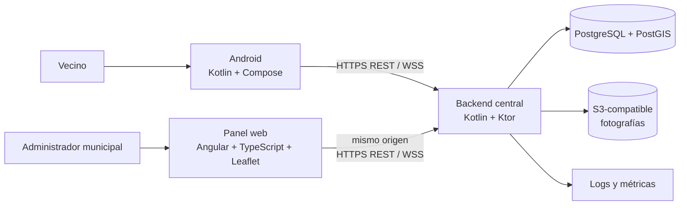
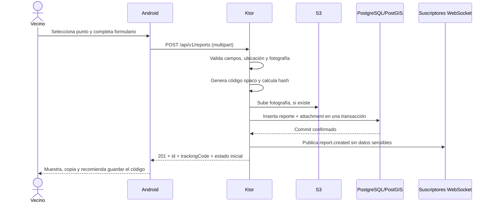
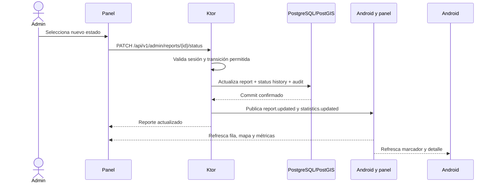

# Arquitectura de solución

## Decisión principal

Mapa Urbano será un monolito modular. Un único proceso Kotlin + Ktor contiene los módulos de negocio, expone la API REST, mantiene las conexiones WebSocket y sirve los archivos estáticos del panel web.

Android y el panel administrativo consumen el mismo backend. La base de datos PostgreSQL + PostGIS y el almacenamiento de fotografías son servicios externos al proceso, pero forman parte de la plataforma.

## Vista de contexto



## Capas del monolito

Cada módulo mantiene sus reglas de negocio y sus adaptadores. Las rutas HTTP no deben acceder directamente a tablas o clientes externos.

```text
Entrada HTTP/WebSocket
        ↓
API del módulo: serialización, autenticación y validación
        ↓
Aplicación: casos de uso y transacciones
        ↓
Dominio: entidades, estados y reglas
        ↓
Infraestructura: repositorios, PostGIS, S3 y eventos
```

### Reglas de dependencia

- `api` puede depender de `application` y de contratos compartidos.
- `application` puede depender de `domain` y de puertos definidos por el módulo.
- `infrastructure` implementa puertos; no define reglas de negocio.
- `domain` no depende de Ktor, SQL, S3 ni clases de Android.
- `shared` contiene errores, reloj, identificadores, paginación y observabilidad transversal.
- Un módulo no consulta las tablas de otro módulo sin pasar por un contrato explícito.

## Módulos del backend

```text
backend-ktor/
└── src/main/kotlin/<paquete>/
    ├── application/          # Arranque de Ktor, configuración y routing raíz
    ├── shared/                # Tipos comunes, errores, paginación, métricas
    ├── auth/                  # Sesiones y autorización de administradores
    ├── reports/               # Alta, consulta, detalle y ciclo de vida
    ├── assignments/           # Equipos, responsables y delegación operativa
    ├── categories/            # Catálogo de categorías
    ├── media/                 # Validación y S3 de fotografías
    ├── statistics/            # Agregaciones para el panel
    ├── notifications/         # Publicación y suscripción de eventos en tiempo real
    └── audit/                 # Registro inmutable de acciones relevantes
```

Las responsabilidades y contratos de cada módulo están en [02-modulos-backend.md](02-modulos-backend.md).

## Flujos principales

### Alta de reporte anónimo



Si falla la escritura en la base de datos después de subir un objeto, el backend debe marcar el objeto para limpieza o ejecutar una compensación. Nunca debe responder éxito sin commit confirmado.

### Cambio de estado administrativo



## Servir el panel Angular desde Ktor

`admin-web` será una aplicación Angular. El proceso de build generará archivos estáticos en `dist/`; Ktor los empaquetará dentro de la imagen o los montará como recursos de la aplicación.

| Ruta | Respuesta | Acceso |
|---|---|---|
| `/admin` | `index.html` del panel | Público solo para mostrar login |
| `/admin/assets/*` | CSS, JS, íconos y Leaflet | Público |
| `/api/v1/*` | API JSON o `multipart/form-data` | Según endpoint |
| `/api/v1/ws/*` | WebSocket | Según canal |
| `/health/live` | Estado de proceso | Interno |
| `/health/ready` | Estado de dependencias críticas | Interno |

Angular se desarrollará con Node.js/npm y su herramienta de build. Node.js no se ejecutará en producción: una etapa de compilación de Docker instalará dependencias y generará `dist/`, y la imagen final de Ktor contendrá solamente el backend y los assets compilados. Durante el desarrollo se podrá usar el servidor de Angular o servir el contenido compilado desde Ktor.

La configuración de producción debe usar un fallback de rutas para que `/admin` y sus rutas internas de Angular funcionen al recargar la página. Las llamadas a la API conservarán el mismo origen y el prefijo `/api/v1`.

## Despliegue lógico

```text
Internet
   │ HTTPS / WSS
   ▼
Proxy o balanceador TLS
   │
   ▼
Contenedor backend-ktor
   ├── API REST
   ├── WebSocket
   └── archivos estáticos admin-web
        │
        ├── PostgreSQL administrado + PostGIS
        ├── S3-compatible
        └── servicio de logs/métricas
```

La terminación TLS puede estar en el proxy o en la plataforma de despliegue. El backend debe conocer `X-Forwarded-Proto` de un proxy confiable y rechazar tráfico inseguro en producción.

## Decisiones operativas iniciales

- Una imagen Docker reproducible para Ktor.
- Un proceso de aplicación por contenedor; el escalado horizontal se habilita cuando haya necesidad.
- PostgreSQL administrado con backups automáticos y prueba de restauración.
- Bucket privado S3-compatible; las fotografías se entregan mediante URLs firmadas de corta duración.
- WebSocket con heartbeat, límite de conexiones y reconexión exponencial en los clientes.
- Migraciones versionadas ejecutadas antes de habilitar una nueva versión del backend.
- Configuración por variables de entorno o secreto administrado; ningún secreto en el repositorio.

## Límites intencionales

- El backend no contiene lógica de presentación de Compose.
- Android no accede a PostgreSQL ni S3 directamente.
- El panel no ejecuta consultas SQL ni usa credenciales de infraestructura.
- Las fotografías no atraviesan WebSocket; el evento solo notifica que el reporte cambió.
- WebSocket no reemplaza REST: REST es la fuente de lectura inicial y WebSocket comunica cambios.
