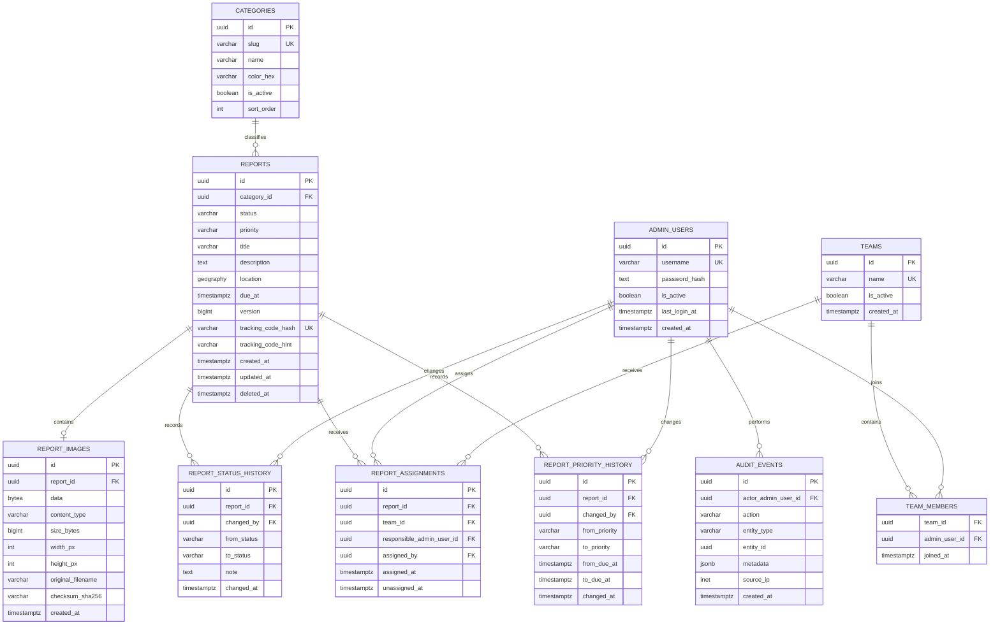

# Modelo de datos y PostGIS

El modelo detallado y un DDL inicial de referencia están en [12-entidades-bd-ejemplo.md](12-entidades-bd-ejemplo.md).

## Principios

- PostgreSQL es la fuente de verdad transaccional.
- PostGIS almacena la ubicación como un punto `geography(Point, 4326)`.
- Los nombres físicos usan `snake_case` y están en inglés para mantener consistencia con los módulos Kotlin.
- Las fechas se guardan como `timestamptz` en UTC.
- Las fotografías se guardan en PostgreSQL como `BYTEA`; la misma fila conserva metadatos, checksum y dimensiones.
- Las claves públicas preferidas son UUID para evitar enumeración trivial de reportes.

## Modelo lógico

## Tablas requeridas

### `reports`

| Campo | Tipo | Reglas |
|---|---|---|
| `id` | UUID | PK, generado por el servidor. |
| `category_id` | UUID | FK a `categories`, obligatorio y activo al crear. |
| `status` | VARCHAR | `pending`, `in_progress` o `resolved`; valor inicial `pending`. |
| `priority` | VARCHAR | `low`, `medium`, `high` o `urgent`; valor inicial `medium`. |
| `title` | VARCHAR(150) | Obligatorio, validado por backend. |
| `description` | TEXT | Obligatoria, límites definidos antes de migrar. |
| `location` | geography(Point, 4326) | Obligatoria; latitud entre -90 y 90, longitud entre -180 y 180. |
| `due_at` | TIMESTAMPTZ | Opcional; fecha objetivo administrativa en UTC. |
| `version` | BIGINT | Comienza en 0 y permite detectar actualizaciones concurrentes. |
| `tracking_code_hash` | CHAR/VARCHAR | Único; HMAC o hash determinista del código opaco. |
| `tracking_code_hint` | VARCHAR(8) | Fragmento no suficiente para consultar; ayuda a soporte. |
| `created_at` | TIMESTAMPTZ | UTC, generado por servidor. |
| `updated_at` | TIMESTAMPTZ | UTC, cambia al editar o cambiar estado. |
| `deleted_at` | TIMESTAMPTZ | Nulo mientras el reporte está visible; habilita baja auditable. |

El código completo no se vuelve a almacenar en texto plano. El backend lo genera con un alfabeto sin caracteres ambiguos, devuelve el valor completo solo al crear el reporte y compara consultas mediante una representación no reversible apropiada.

### `admin_users`

| Campo | Tipo | Reglas |
|---|---|---|
| `id` | UUID | PK. |
| `username` | VARCHAR(80) | Único, normalizado y no sensible a mayúsculas. |
| `password_hash` | TEXT | Hash adaptativo; nunca contraseña plana. |
| `is_active` | BOOLEAN | Permite revocar acceso sin borrar historial. |
| `last_login_at` | TIMESTAMPTZ | Nulo hasta el primer login. |
| `created_at` | TIMESTAMPTZ | UTC. |

### `report_status_history`

| Campo | Tipo | Reglas |
|---|---|---|
| `id` | UUID | PK. |
| `report_id` | UUID | FK a `reports`; debe conservar historial aunque el reporte se dé de baja. |
| `changed_by` | UUID | FK a `admin_users`; los cambios administrativos siempre tienen actor. |
| `from_status` | VARCHAR | Nulo solo en la creación inicial si se registra como transición. |
| `to_status` | VARCHAR | Estado resultante. |
| `note` | TEXT | Opcional; no incluir datos sensibles. |
| `changed_at` | TIMESTAMPTZ | UTC. |

### `teams` y `team_members`

| Tabla/campo | Tipo | Reglas |
|---|---|---|
| `teams.id` | UUID | PK. |
| `teams.name` | VARCHAR(120) | Único y obligatorio. |
| `teams.is_active` | BOOLEAN | Un equipo inactivo conserva historial pero no recibe nuevas asignaciones. |
| `team_members.team_id` | UUID | FK a `teams`; parte de la PK compuesta. |
| `team_members.admin_user_id` | UUID | FK a `admin_users`; parte de la PK compuesta. |
| `team_members.joined_at` | TIMESTAMPTZ | UTC. |

### `report_assignments`

Cada fila representa un período de asignación. La asignación activa tiene `unassigned_at` nulo.

| Campo | Tipo | Reglas |
|---|---|---|
| `id` | UUID | PK. |
| `report_id` | UUID | FK a `reports`; obligatorio. |
| `team_id` | UUID | FK a `teams`; opcional. |
| `responsible_admin_user_id` | UUID | FK a `admin_users`; opcional. |
| `assigned_by` | UUID | FK a `admin_users`; actor obligatorio. |
| `assigned_at` | TIMESTAMPTZ | UTC. |
| `unassigned_at` | TIMESTAMPTZ | Nulo mientras la asignación está activa. |

Una asignación activa debe indicar equipo, responsable o ambos. Cuando ambos están presentes, el responsable debe ser integrante activo del equipo. Un índice único parcial garantiza como máximo una asignación activa por reporte.

### `report_priority_history`

| Campo | Tipo | Reglas |
|---|---|---|
| `id` | UUID | PK. |
| `report_id` | UUID | FK a `reports`; obligatorio. |
| `changed_by` | UUID | FK a `admin_users`; actor obligatorio. |
| `from_priority` / `to_priority` | VARCHAR | Valores del catálogo fijo de prioridad. |
| `from_due_at` / `to_due_at` | TIMESTAMPTZ | Conservan el cambio de fecha objetivo. |
| `changed_at` | TIMESTAMPTZ | UTC. |

### `report_images`

| Campo | Tipo | Reglas |
|---|---|---|
| `id` | UUID | PK. |
| `report_id` | UUID | FK a `reports`; `ON DELETE CASCADE` si la política permite borrar el reporte. |
| `data` | BYTEA | Binario validado; nunca Base64 ni incluido en listados JSON. |
| `content_type` | VARCHAR(100) | `image/jpeg`, `image/png` o `image/webp`. |
| `size_bytes` | BIGINT | Entre 1 y 5 MB; debe coincidir con `octet_length(data)`. |
| `width_px` | INTEGER | Ancho positivo dentro del límite aprobado. |
| `height_px` | INTEGER | Alto positivo dentro del límite aprobado. |
| `original_filename` | VARCHAR(255) | Opcional e informativo; no se usa para resolver el recurso. |
| `checksum_sha256` | CHAR(64) | Integridad y ETag; no reemplaza la validación de contenido. |
| `created_at` | TIMESTAMPTZ | UTC. |

Para el MVP se crea una restricción única sobre `report_id`, porque cada reporte admite como máximo una imagen. Si más adelante se permiten varias, se reemplaza por un campo `sort_order` y un límite de negocio.

### Estrategia de almacenamiento binario

- PostgreSQL administrará el almacenamiento interno mediante TOAST; la aplicación no depende de su representación física.
- Los repositorios de listado seleccionan columnas explícitas y nunca incluyen `data`.
- El binario se consulta por ID mediante una operación dedicada y autorización previa.
- `CHECK (size_bytes = octet_length(data))` evita divergencias entre metadatos y contenido.
- Los backups, réplicas y restauraciones incluyen las imágenes; capacidad, I/O y tiempos de recuperación deben medirse con datos representativos.
- No se crean índices sobre `data`. Se indexan `report_id`, `checksum_sha256` y `created_at` solo cuando una consulta real lo justifique.

### `categories`

| Campo | Tipo | Reglas |
|---|---|---|
| `id` | UUID | PK. |
| `slug` | VARCHAR(50) | Único, estable y sin acentos. |
| `name` | VARCHAR(80) | Texto visible, inicialmente en español. |
| `color_hex` | CHAR(7) | Color de referencia para mapa; no sustituye texto ni ícono. |
| `is_active` | BOOLEAN | Las categorías inactivas no aparecen en altas nuevas. |
| `sort_order` | INTEGER | Orden de presentación. |

## Tablas de soporte del backend

La arquitectura también requiere estas tablas o equivalentes:

- `audit_events`: historial de acciones de seguridad y administración.
- `sessions`: sesiones revocables del panel, si se elige persistirlas en PostgreSQL.
- `outbox_events`: opcional, para publicar eventos confiablemente después del commit.
- `notification_events`: opcional en el MVP; útil cuando se agreguen push o email.

Las tablas `reports`, `report_images`, `admin_users`, `report_status_history`, `categories`, `teams`, `team_members`, `report_assignments` y `report_priority_history` son obligatorias desde la primera migración funcional.

## Restricciones e índices

Antes de implementar migraciones se deben fijar las restricciones equivalentes a las siguientes:

| Objeto | Propósito |
|---|---|
| Índice GIST sobre `reports.location` | Consultas por ventana geográfica y proximidad. |
| Índice sobre `reports.status, reports.created_at` | Filtros y orden del panel. |
| Índice sobre `reports.priority, reports.due_at` | Cola operativa por urgencia y vencimiento. |
| Índice sobre `reports.category_id, reports.created_at` | Filtro por categoría. |
| Índice único sobre `reports.tracking_code_hash` | Búsqueda de seguimiento sin duplicados. |
| Índice único sobre `report_images.report_id` | Una imagen como máximo por reporte en el MVP. |
| Índice sobre `report_images.checksum_sha256` | Verificación y diagnóstico de integridad sin consultar el binario. |
| Índice sobre `report_status_history.report_id, changed_at` | Línea de tiempo del reporte. |
| Índice único parcial sobre `report_assignments.report_id` con `unassigned_at IS NULL` | Una sola asignación activa por reporte. |
| Índice sobre `report_assignments.team_id, responsible_admin_user_id` | Filtros por equipo y responsable. |
| Índice sobre `report_priority_history.report_id, changed_at` | Historial de prioridad y fecha objetivo. |
| Índice único sobre `categories.slug` | Contrato estable para clientes. |
| Índice sobre `audit_events.entity_type, entity_id, created_at` | Auditoría por entidad. |

El endpoint de mapa debe exigir `bbox`, radio o límite máximo. No se permitirá descargar la tabla completa sin paginación.

## Consultas geográficas esperadas

- `bbox`: reportes cuya geometría intersecta el rectángulo visible.
- `near`: reportes dentro de un radio en metros, si se incorpora búsqueda de cercanía.
- `cluster`: agrupación o simplificación en cliente para densidades altas; el backend mantiene el límite de resultados.

Las coordenadas de respuesta se serializan como `latitude` y `longitude`. La base conserva una única geometría para evitar inconsistencias entre columnas latitud/longitud.

## Migraciones y datos iniciales

1. Activar la extensión PostGIS.
2. Crear enums o restricciones de estado.
3. Crear tablas en orden de dependencias.
4. Crear índices y restricciones.
5. Insertar categorías iniciales de manera idempotente.
6. Crear el primer administrador por un procedimiento seguro fuera de los commits de código.
7. Ejecutar una prueba de rollback y una restauración en un entorno descartable.
