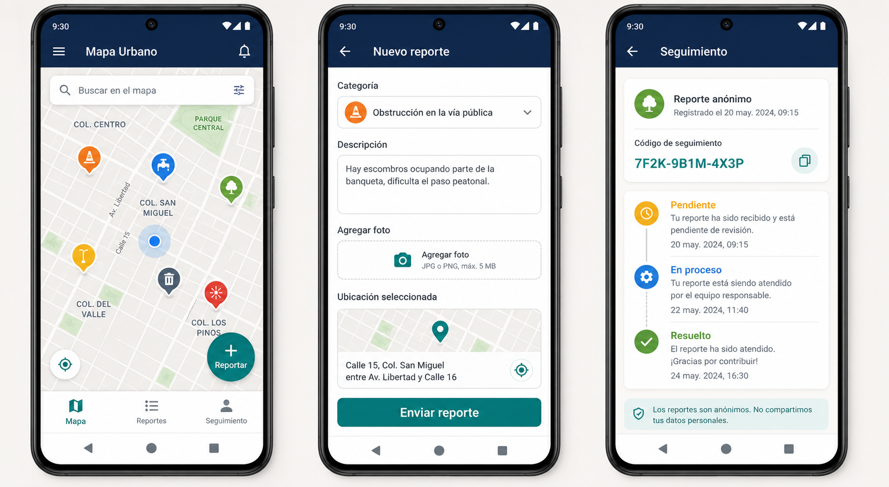
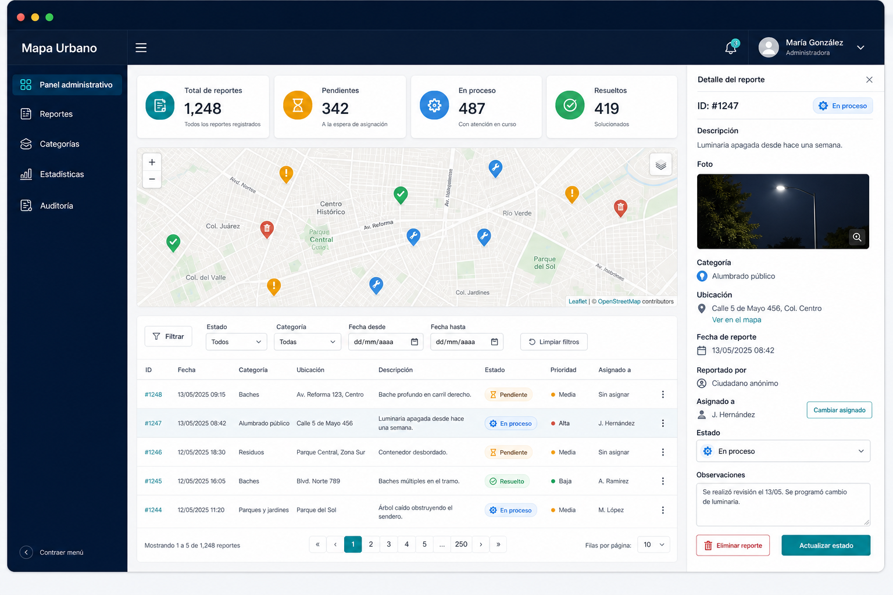

# UX e interfaces

## Nota de diseño

Los mockups son referencias conceptuales de alta fidelidad. Sirven para validar jerarquía, flujo y contenido. No sustituyen pruebas con vecinos ni la especificación final de componentes.

Las hipótesis de usuario se deben validar antes de congelar textos o prioridades visuales.

## Personas iniciales como hipótesis

### Vecino que reporta

**Objetivo:** informar un problema en el lugar exacto y elegir entre conservarlo en una cuenta o mantener el envío anónimo.

**Necesidades:** mapa claro, registro breve, formulario simple, elección de privacidad comprensible y seguimiento accesible.

**Riesgos:** poca conectividad, temor a exponer datos, ubicación incorrecta, confusión entre ambos modos y pérdida del código anónimo.

### Operador municipal

**Objetivo:** localizar reportes, priorizar la atención y actualizar estados con trazabilidad.

**Necesidades:** filtros rápidos, mapa y tabla sincronizados, detalle suficiente y confirmación de acciones destructivas.

**Riesgos:** exceso de marcadores, estados ambiguos, cambios accidentales y falta de contexto histórico.

## Arquitectura de información

### Android

- **Mapa:** vista inicial, marcadores, filtros y acción principal `Reportar`.
- **Acceso:** registro e inicio de sesión opcionales, sin bloquear la alternativa anónima.
- **Nuevo reporte:** campos, foto opcional, ubicación seleccionada y acción `Enviar reporte`.
- **Modo de envío:** elección explícita `Guardar en mi cuenta` o `Reportar anónimamente`.
- **Confirmación:** acceso a `Mis reportes` en modo cuenta; código con `Copiar` y `Compartir` en modo anónimo.
- **Mis reportes:** listado privado de reportes asociados a la cuenta y acceso a su estado.
- **Seguimiento:** ingreso del código, estado actual e historial público.
- **Cuenta:** perfil mínimo y cierre de sesión.
- **Detalle:** categoría, descripción, fecha, ubicación y fotografía cuando corresponda.

### Panel web

- **Inicio / panel administrativo:** métricas, mapa y reportes recientes.
- **Reportes:** tabla paginada, filtros, detalle lateral, prioridad y delegación.
- **Equipos:** catálogo de equipos e integrantes disponibles para asignación.
- **Categorías:** catálogo activo y orden de presentación.
- **Estadísticas:** distribución por estado y categoría.
- **Auditoría:** acciones administrativas filtrables.
- **Sesión:** login y logout.

El panel debe mantener entre cinco y siete elementos de navegación principal. En móvil o pantallas estrechas, la navegación secundaria puede colapsar.

## Mockup Android



La imagen existente representa la rama anónima. El flujo completo pasa a ser:

```text
Mapa → Reportar → Elegir modo
                    ├─ Cuenta → Registro/Login → Nuevo reporte → Mis reportes
                    └─ Anónimo → Nuevo reporte → Código → Seguimiento
```

### Flow: crear reporte con cuenta

**Objetivo:** conservar el reporte dentro de `Mis reportes` sin depender de un código.

1. **Mapa** → toca `Reportar` → elige `Guardar en mi cuenta`.
2. Si no tiene sesión, completa **Registro** o **Iniciar sesión** y vuelve al formulario sin perder ubicación.
3. Completa título, categoría, descripción, ubicación y foto opcional.
4. Confirma `Enviar con mi cuenta`; la aplicación no solicita ni envía un identificador de usuario.
5. **Confirmación** → muestra estado `Pendiente` y acción `Ver en Mis reportes`.

Si la sesión expira, la aplicación conserva el formulario localmente, solicita iniciar sesión y solo después reintenta. Nunca cambia automáticamente el modo a anónimo.

### Flow: crear reporte anónimo

**Objetivo:** registrar un problema con ubicación y evidencia opcional.

**Entrada:** usuario toca `Reportar`, selecciona un punto y elige `Reportar anónimamente`.

**Éxito:** el servidor responde `201`; la aplicación muestra el código completo y el estado `Pendiente`.

#### Pasos

1. **Mapa** → toca `Reportar` → elige `Reportar anónimamente` → **Nuevo reporte** con ubicación precargada.
2. **Nuevo reporte** → completa título, categoría y descripción → agrega foto opcional.
3. **Nuevo reporte** → confirma ubicación → toca `Enviar reporte`.
4. **Confirmación** → copia o comparte el código → entra a **Seguimiento**.

Si existe una sesión, antes de enviar se informa: “Este reporte no aparecerá en Mis reportes y no podremos vincularlo después”. Las acciones son `Continuar anónimamente` y `Guardar en mi cuenta`.

#### Estados de error y recuperación

| Situación | Mensaje y recuperación |
|---|---|
| Sin conexión | “No pudimos enviar el reporte. Revisá tu conexión y reintentá.” Conserva el formulario. |
| Coordenada inválida | “Seleccioná un punto dentro del área habilitada.” Permite volver al mapa. |
| Foto demasiado grande | “La foto supera 5 MB. Elegí otra imagen.” No sube el archivo. |
| Formato no permitido | “Usá una imagen JPG, PNG o WebP.” Mantiene el resto del formulario. |
| Error del servidor | “No pudimos guardar el reporte. Intentá nuevamente.” No muestra detalles internos. |
| Alta exitosa | Muestra el código una vez, con acción de copiar y aviso para guardarlo. |
| Sesión expirada en modo cuenta | Conserva el formulario y solicita iniciar sesión; no envía como anónimo automáticamente. |
| Correo ya registrado | Ofrece iniciar sesión o recuperar acceso cuando esa función esté disponible, sin perder el formulario. |

### Flow: consultar seguimiento

**Entrada:** pestaña `Seguimiento`.

**Éxito:** el usuario ve estado actual, fechas y eventos públicos.

#### Reglas

- El campo debe tener etiqueta visible: `Código de seguimiento`.
- El código se puede pegar con o sin guiones.
- Se normaliza en cliente, pero la validación final siempre ocurre en backend.
- El error debe ser genérico: “No encontramos un reporte con ese código o no está disponible”.
- El historial distingue estado actual de estados anteriores mediante texto, ícono y orden temporal.

## Mockup del panel administrativo



La imagen muestra la composición de trabajo aprobada para el MVP. La asignación manual y la prioridad forman parte del alcance; la asignación automática y la planificación avanzada de cuadrillas quedan fuera.

### Flow: gestionar reporte

**Objetivo:** localizar un reporte, revisar evidencia y actualizar su estado.

**Entrada:** usuario autenticado en `/admin`.

**Éxito:** estado guardado, historial registrado y mapa/estadísticas actualizados.

#### Pasos

1. **Login** → ingresa credenciales → **Panel administrativo**.
2. **Panel** → filtra por estado, categoría o fecha → selecciona fila o marcador.
3. **Detalle** → revisa ubicación, descripción y fotografía → elige estado, prioridad y fecha objetivo.
4. **Detalle** → delega el reporte a un equipo o responsable disponible.
5. **Detalle** → confirma los cambios → recibe confirmación y ve el historial actualizado.

### Flow: organizar la cola operativa

1. **Reportes** → filtra por prioridad, equipo, responsable, estado o vencimiento.
2. **Reportes** → ordena por urgencia y fecha objetivo sin perder los filtros activos.
3. **Selección** → aplica asignación o prioridad a uno o varios reportes cuando el permiso lo habilita.
4. **Conflicto** → si otro administrador modificó un reporte, el panel informa el cambio y recarga los datos antes de reintentar.

#### Acción destructiva

`Eliminar reporte` exige un diálogo específico:

> “Se ocultará este reporte del mapa público. La acción quedará registrada en la auditoría.”

Acciones: `Eliminar reporte` y `Conservar reporte`. Nunca usar botones ambiguos como `Sí` y `No`.

## Componentes y estados

| Componente | Estados mínimos |
|---|---|
| Marcador de mapa | Normal, seleccionado, oculto por filtro, agrupado, sin conexión. |
| Chip de estado | Pendiente, En proceso, Resuelto, foco, deshabilitado; siempre con texto/ícono. |
| Campo de formulario | Vacío, foco, válido, error, cargando, deshabilitado. |
| Selector de modo | Cuenta, anónimo, explicación de privacidad, confirmación del cambio. |
| Registro/login de vecino | Vacío, validando, error genérico, sesión creada, sesión expirada. |
| Mis reportes | Cargando, vacío, resultados, paginación, error y sesión expirada. |
| Subida de foto | Sin archivo, previsualización, subiendo, éxito, rechazo, reintento. |
| Tabla | Cargando, vacía, resultados, error, paginación, selección. |
| Selector de asignación | Sin asignar, equipo, responsable, cargando, conflicto, sin resultados. |
| Prioridad | Baja, media, alta, urgente, foco y deshabilitada; siempre con texto e ícono. |
| WebSocket | Conectado, reconectando, sincronizando, desconectado. |
| Diálogo | Confirmación, cancelación, error de operación. |

## Accesibilidad y contenido

- Contraste mínimo WCAG AA: 4.5:1 para texto normal y 3:1 para texto grande.
- El panel debe funcionar con teclado, foco visible y orden lógico.
- Controles táctiles de al menos 44 × 44 px; Android debe contemplar uso con una mano.
- Toda imagen relevante tiene texto alternativo; el mockup se marca como referencia conceptual.
- Los formularios usan etiquetas visibles, mensajes junto al campo y resumen de errores.
- Estado y categoría se comunican con color, texto e ícono.
- El mapa ofrece una alternativa de lista para usuarios que no puedan interpretar el mapa.
- El panel soporta zoom del navegador al 200% sin perder acciones críticas.
- Los mensajes usan lenguaje directo y describen cómo recuperarse.
- Las actualizaciones WebSocket se anuncian de forma no intrusiva y no roban el foco.

## Pruebas UX propuestas

Antes de implementar el diseño final:

1. Entrevistar a 5–8 vecinos sobre cómo reportan hoy, si crearían una cuenta y cómo interpretan “anónimo”.
2. Probar el alta Android con al menos cinco participantes.
3. Medir tiempo para localizar un reporte y cambiar su estado en el panel.
4. Validar si “Pendiente”, “En proceso” y “Resuelto” son comprendidos sin explicación.
5. Ejecutar prueba de teclado y lector de pantalla en login, tabla, filtros y diálogo de eliminación.
6. Probar red lenta, pérdida de conexión y reconexión durante el alta.
7. Verificar que los participantes distingan qué reportes aparecerán en `Mis reportes` y cuáles dependerán del código.
