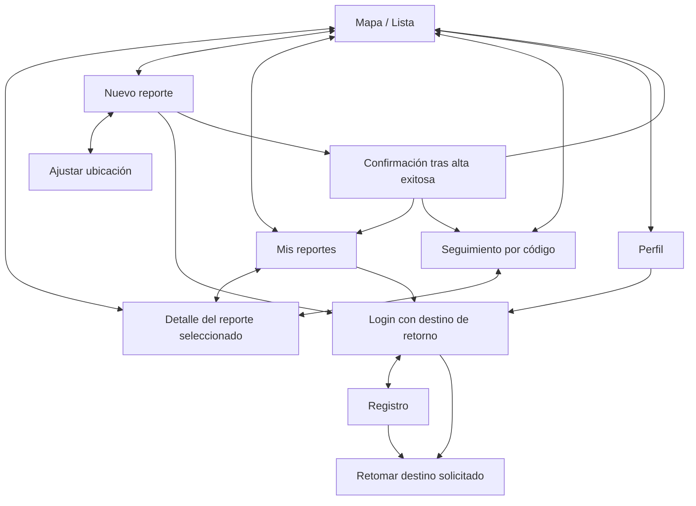
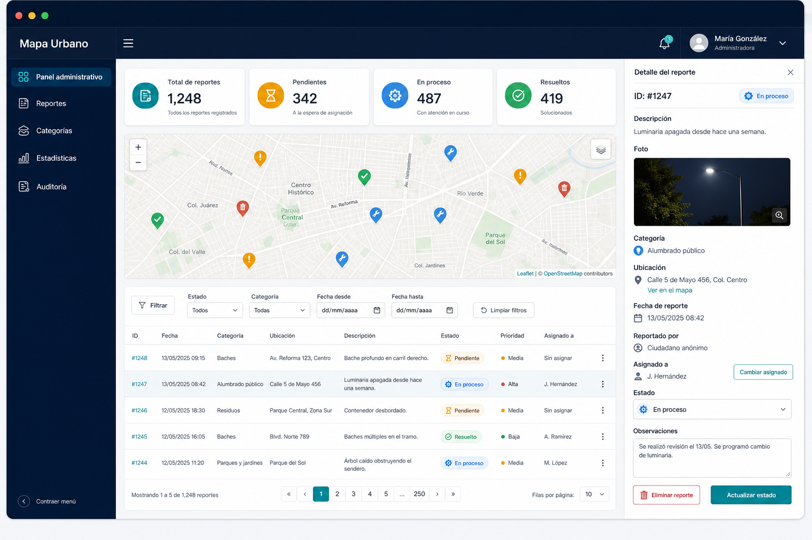

# UX e interfaces

## Referencia vigente y límites

Revisión funcional: **8 de septiembre de 2026**. Fuente visual: [Mapa-Urbano en Google Stitch](https://stitch.withgoogle.com/projects/12550160159359787648), proyecto `12550160159359787648`. La marca visible **MuniReport** se conserva; el producto y repositorio se llaman Mapa Urbano.

La especificación funcional de este documento conserva el MVP aprobado. El diseño de Stitch es una referencia visual y un prototipo con datos de demostración, **no una implementación de Android ni evidencia de servicios productivos**. Los [resultados de verificación](13-verificacion-stitch.md) distinguen comportamiento observado, limitaciones y pruebas pendientes. Ante una diferencia, los contratos de [API](04-api-y-tiempo-real.md), privacidad y alcance rigen el comportamiento; las capturas rigen la estética, no amplían el alcance.

Se conservan paleta, Inter, iconos, formas, espaciado, jerarquía y distribución de las pantallas actuales. Solo se autorizan cambios de flujo, scroll, transiciones y textos funcionales. No reaplicar ni regenerar el sistema visual global: el DESIGN.md de Stitch contiene valores narrativos y tokens distintos, y no debe usarse para cambiar el aspecto renderizado.

### Inventario trazable de pantallas de origen

Los IDs siguientes son las referencias previas a la corrección. Las revisiones resultantes y su relación con los originales se registran en el [informe](13-verificacion-stitch.md). No borrar versiones anteriores ni incorporar pantallas ocultas al flujo vigente por su sola presencia en el lienzo.

| Destino lógico | Pantalla en Stitch | ID de origen | Referencia visual |
|---|---|---|---|
| Mapa | Mapa de Reportes Ciudadanos (Interactivos) | `956adf6462e44773b28c46683ace6d2e` | [Captura](assets/interfaces/stitch-2026-09-08/mapa-antes.png) |
| Mis reportes | Mis Reportes Ciudadanos (Interactivos) | `3711e979f3534240abd4697c126fbc04` | [Captura](assets/interfaces/stitch-2026-09-08/mis-reportes-antes.jpg) |
| Nuevo reporte | Crear Nuevo Reporte | `ffb2e937c97b4e6b8a165c39c7df8e08` | [Captura](assets/interfaces/stitch-2026-09-08/nuevo-reporte-antes.png) |
| Confirmación | Confirmación de Reporte | `0b509b90645a4e5498dad56c61c57643` | [Captura](assets/interfaces/stitch-2026-09-08/confirmacion-antes.png) |
| Seguimiento | Seguimiento de Reporte | `cb5e83d793d14ffb90a598f7a0650d02` | [Captura](assets/interfaces/stitch-2026-09-08/seguimiento-antes.png) |
| Login | Iniciar Sesión | `a2672ec75335486fb0b507b5db8b02c5` | [Captura](assets/interfaces/stitch-2026-09-08/login-antes.jpg) |
| Registro | Crear Cuenta | `4354a113786847f68e43358cd520348f` | [Captura](assets/interfaces/stitch-2026-09-08/registro-antes.jpg) |
| Perfil | Administración de Perfil | `31d374a4053f4424818280ec1c1419aa` | [Captura](assets/interfaces/stitch-2026-09-08/perfil-antes.png) |
| Prototipo integrado | Municipal Citizen Reporting App | `7dceabc3403049619e0ea2e0cd123763` | Sin captura suministrada en la exportación inicial |

Otras referencias conservadas: Mapa Interactivo MuniReport `c992ab8fd6c64348bf59640665a7d688`, Mis Reportes Ciudadanos `aeb25ffd4f8e4055b3cf20f6b96ccec1`. El icono `e24c86d0b2f844faa10c8843ce60c9d7` y el avatar `188e3c23e4a9405ebf26759740acf3c1` son recursos, no destinos de navegación. El [mockup Android anterior](assets/interfaces/android-flujo-reporte-seguimiento.png) queda como antecedente conceptual.

## Usuarios y arquitectura de información

El vecino necesita localizar una incidencia, reportarla con cuenta o anónimamente y consultar su estado sin perder contexto. Estas necesidades son hipótesis de producto; esta revisión no sustituye pruebas con vecinos.

Android tiene cuatro destinos principales, conservando su orden y presentación: **Mapa, Reportar, Mis Reportes y Seguimiento**. El avatar abre Perfil si hay sesión o Login con retorno a Perfil. Login y Registro son accesos opcionales. Detalle, selector de ubicación, ayuda, filtros y avisos son destinos secundarios con retorno definido.

Todas las pantallas operativas deben ser alcanzables desde Mapa mediante recorridos válidos y tener salida. Esto no implica enlazar cada pantalla directamente con todas las demás. Los recursos y versiones históricas no forman parte de este grafo.

```mermaid
flowchart TD
    M[Mapa / Lista] <--> D[Detalle del reporte seleccionado]
    M <--> N[Nuevo reporte]
    M <--> R[Mis reportes]
    M <--> S[Seguimiento por código]
    M <--> P[Perfil]
    R <--> D
    N <--> U[Ajustar ubicación]
    N --> L[Login con destino de retorno]
    R --> L
    P --> L
    L <--> G[Registro]
    L --> O[Retomar destino solicitado]
    G --> O
    N --> C[Confirmación tras alta exitosa]
    C --> R
    C --> S
    C --> M
    S <--> D
```

Las aristas hacia Mis reportes y Perfil exigen sesión; su cancelación vuelve al origen público. Confirmación elige su salida según `submissionMode`; no requiere crear una pantalla distinta para cada modo.

## Estado y reglas de navegación

- Mantener un historial interno de destinos y parámetros. Atrás cierra primero el diálogo/panel superior; luego vuelve al destino anterior y restaura su estado. Sin historial interno, volver a Mapa. No depender de `history.back()` del documento anfitrión de Stitch.
- Conservar por destino búsqueda, filtros, posición de lista, centro/zoom del mapa, selección y el ID del reporte. Cambiar pestañas no crea copias ilimitadas del mismo destino. En la raíz Mapa, el botón Atrás del prototipo permanece en Mapa; en Android se delega la salida de la aplicación al sistema, sin abrir navegador.
- El borrador conserva título, descripción, categoría, modalidad, coordenadas y referencia local a una única foto. Ajustar ubicación trabaja sobre una selección temporal: Confirmar aplica; Cancelar restaura el punto previo. Denegar GPS permite selección manual.
- Salir de un borrador modificado ofrece **Conservar borrador** o **Descartar**; cerrar el aviso vuelve al formulario. Conservar permite navegar y retomar; descartar limpia. Una foto reemplazada no crea una segunda evidencia.
- Login/Registro conservan el destino solicitado y el borrador; no conservar contraseñas en historial, URLs, logs ni almacenamiento del prototipo. Cancelar vuelve al origen. Tras autenticarse, retomar exactamente el destino solicitado.
- Enviar deshabilita el botón mientras está pendiente. Solo una respuesta `201` abre Confirmación. El éxito consume el borrador y reemplaza la entrada de envío: volver no repite el POST ni muestra el formulario consumido. Un nuevo Reportar inicia otro borrador.
- La confirmación mantiene el resultado del alta durante la sesión del flujo, incluido el código anónimo hasta que el usuario abandone esa confirmación. Nunca pedir a la API recuperar un código completo perdido.
- Cerrar sesión limpia vistas privadas e historial autenticado y vuelve a Mapa. No transforma un borrador `account` en anónimo; requiere autenticación al retomarlo. Desactivar cuenta exige confirmación específica, revoca todas las sesiones y conserva reportes según política municipal.

## Matriz de acciones e integración

Prefijo de rutas de negocio: `/api/v1`. Los destinos son lógicos para el futuro router de Compose; no se añaden endpoints por cada pantalla ni se adopta el HTML de Stitch como tecnología de Android.

| Origen / acción | Destino y retorno | Datos conservados / estados | Dependencia |
|---|---|---|---|
| Barra Mapa / Lista | Mismo destino con representación elegida | Filtros, búsqueda, centro, zoom; carga/vacío/error/resultados | `GET /reports`, `GET /categories` |
| Marcador, tarjeta o Ver detalle | Detalle del ID seleccionado; volver al origen | ID, origen y scroll; carga/no disponible/error | `GET /reports/{id}` o `GET /users/me/reports/{id}` según contexto |
| Filtros / Aplicar / Cancelar | Panel de filtros → origen | Aplicar guarda estado y categoría; Cancelar conserva valores anteriores | Mismos endpoints de listado; búsqueda local sobre resultados cargados |
| FAB, Reportar aquí, barra Reportar | Formulario completo; volver al origen | Punto seleccionado o selección manual, borrador; no usar un segundo formulario simplificado | `GET /categories` |
| Guardar en mi cuenta sin sesión | Login ↔ Registro → formulario | Borrador, modo `account`, destino; validación/error/sesión expirada | `POST /users/login`, `POST /users/register` |
| Reportar anónimamente | Mismo formulario | Modo explícito `anonymous`; si hay sesión, explicar que no aparecerá en Mis reportes | No requiere login |
| Mi ubicación / Ajustar mapa | Selector → formulario | Coordenadas temporales, precisión disponible; permiso denegado/GPS no disponible | Permiso Android y SDK de mapa; no endpoint nuevo |
| Foto / Reemplazar / Quitar | Cámara o selector del sistema → formulario | Una foto válida o ausencia; cancelar no borra la anterior | Cámara/galería; `photo` del multipart |
| Enviar reporte | Confirmación; luego Mapa, Mis reportes o Seguimiento | Mismo título/categoría/coordenadas/foto/ID/modo; pendiente/error/éxito | `POST /reports`; autor derivado de sesión |
| Confirmación con cuenta | Mis reportes o detalle propio; Mapa | ID del alta, sin código anónimo | `GET /users/me/reports`, `GET /users/me/reports/{id}` |
| Confirmación anónima / Ver seguimiento | Seguimiento precargado; volver a confirmación mientras exista, o Mapa | Código completo recibido y datos del mismo reporte | `POST /report-status` |
| Copiar / Compartir código | Hoja del sistema o feedback; permanecer en origen | Solo código del reporte anónimo actual; éxito/error/cancelación | Portapapeles y hoja de compartir; no copiar URL del editor Stitch |
| Seguimiento / Pegar / Consultar | Resultado y detalle; volver a consulta | Normalizar espacios y guiones; vacío/carga/error genérico/resultados | Portapapeles, `POST /report-status` |
| Mis reportes / Buscar / Estado | Listado privado y detalle; retorno a misma posición | Sesión, filtros, resultados paginados; vacío/error/401 | `GET /users/me/reports` |
| Avatar | Perfil o Login con retorno a Perfil | Datos propios; invitado/carga/error | `GET /users/me` |
| Perfil / Ver todos / Historial reciente | Mis reportes o detalle propio | ID y posición de origen | API privada de reportes |
| Cerrar sesión | Mapa | Limpiar sesión y vistas privadas; informar error si la revocación falla | `POST /users/logout` |
| Eliminar Cuenta Ciudadana | Confirmación de desactivación → Mapa; Cancelar → Perfil | Explicar conservación de reportes; en error conservar sesión y permitir reintento | `DELETE /users/me` |
| Ayuda | Panel contextual desplazable → origen | Foco y scroll de origen | Contenido local |
| Función fuera del MVP | Aviso desplazable → origen | No ejecutar operación ni simular éxito | Sin endpoint en esta entrega |

**Detalle consistente:** no abrir siempre el primer reporte ni un modal de contenido fijo. Mis reportes puede consultar el historial público propio sin solicitar un código. El detalle público nunca incluye identidad del vecino, responsable interno o notas administrativas. Una actualización REST/WS conserva foco y selección; si el reporte desaparece, mostrar No disponible con retorno.

**Filtros:** estado y categoría se combinan, no se anulan entre sí por compartir estilo de chip. Mapa y Lista presentan el mismo conjunto. Los contadores derivan del conjunto disponible; la búsqueda sobre datos cargados no se anuncia como búsqueda global. Las opciones de votos/urgencia pública quedan como función futura, no se confunden con la prioridad administrativa.

## Scroll, áreas seguras y movimiento

Todas las pantallas admiten desplazamiento vertical cuando el contenido excede su área, aunque inicialmente parezcan cortas: Mapa, Lista, Nuevo reporte, Confirmación, Login, Registro, Perfil, Seguimiento, Detalle, selector y todos los diálogos. No agregar espacio vacío artificial para forzar scroll cuando el contenido cabe.

- Usar un único propietario de scroll vertical por pantalla. Listas extensas serán listas virtualizadas; formularios y contenidos cortos, contenedores desplazables. Evitar dos scrolls verticales compitiendo sobre el mismo contenido.
- Barras y FAB conservan posición visual. El relleno inferior cubre la altura efectiva de navegación/acciones más el área segura del dispositivo. El valor de referencia de Stitch (barra 80 dp y separación nominal 96 dp) no reemplaza medir los insets reales.
- Teclado: reducir el área útil y llevar el campo enfocado y su error a la vista; el último campo y Enviar deben ser alcanzables. No usar alturas fijas que recorten contenido.
- Diálogos y paneles tienen altura máxima disponible, cuerpo desplazable y cierre alcanzable. Al cerrarlos, devolver foco al disparador y mantener scroll de origen.
- En Mapa, el gesto iniciado dentro del mapa desplaza el mapa; en los paneles/listas desplaza contenido. El mapa tiene altura acotada y no absorbe todo el recorrido exterior. La alternativa Lista ofrece acceso a los mismos reportes.
- Sin scroll horizontal accidental a 360/390 dp, con texto al 200% o en horizontal. Las filas de chips pueden desplazarse horizontalmente de forma deliberada y accesible.
- Áreas táctiles Android de al menos 48 × 48 dp sin ampliar innecesariamente la huella visual del icono. Etiquetas accesibles para volver, avatar, cámara, quitar foto, ubicación y copiar.

| Transición | Duración | Comportamiento |
|---|---:|---|
| Cambio de pestaña | 150 ms | Fundido suave, conservar estado por pestaña |
| Avanzar / volver | 200 ms | Desplazamiento leve de hasta 16 dp con dirección inversa al volver |
| Abrir / cerrar panel | 200 ms | Desplazamiento vertical leve y fundido |
| Movimiento reducido | 0 ms | Cambio inmediato sin desplazamiento ni scroll animado |

Las transiciones son interrumpibles, no bloquean pulsaciones ni esperan a una animación para actualizar el estado. En prototipo web respetar `prefers-reduced-motion`; en Android respetar la configuración de animaciones del sistema.

## Ajustes funcionales sin ampliar el MVP

| Elemento visible | Comportamiento de esta versión |
|---|---|
| Login/Registro/Perfil con encabezado Detalle Del Reporte | Corregir por Iniciar sesión, Crear cuenta y Perfil, manteniendo estilo y posición |
| Registro | Solo `displayName`, `email`, `password`; no afirmar verificación por correo ni residencia |
| DNI, teléfono, distrito | Conservar posición visual como referencia no editable, rotular No requerido en esta versión; no exigir ni enviar esos datos |
| Google, biometría, recuperar contraseña | Aviso Función prevista para una próxima versión y retorno; login por correo sigue operativo |
| Editar/Guardar perfil, avatar, niveles cívicos | Perfil mínimo de consulta; edición, gamificación y estadísticas avanzadas son futuras |
| Push, alertas, boletín, recibir aviso de resolución | Aviso de función futura, sin activar suscripciones; WS solo actualiza datos durante el uso |
| Apoyar/votar, Ver acta, radar/cuadrillas, métricas vecinales | Aviso de función futura; no fabricar votos, descargas, ubicación en vivo ni porcentajes |
| Términos/privacidad y asistencia 147 | Panel con cierre; contenido/contacto municipal pendiente de validación. No publicar términos inventados ni habilitar llamadas a un número de ejemplo |
| Identidad del autor en ficha pública | Sustituir por Reporte ciudadano; nunca derivar nombre ni correo desde la API |
| Fotografías +2 / 10 MB | Una foto opcional, máximo 5 MB, JPG/PNG/WebP; conservar contenedor y permitir reemplazo |
| Código MNR-XXXXX | Ejemplo de código opaco no secuencial `7F2K-9B1M-4X3P`; el formato definitivo depende del backend, no de un ID público |
| Inspección en 24 h, cuadrilla en camino | Mensaje neutral de recepción/estado público; no prometer plazos ni atención en vivo |
| Eliminar cuenta | Confirmación explica desactivación lógica, revocación de sesiones y conservación de reportes |

Los textos de aviso usan componentes existentes y un botón Volver/Cerrar. Las opciones futuras no desaparecen ni cambian la composición, pero tampoco recogen información o ejecutan operaciones sin soporte. Los datos de demostración no deben trasladarse como defaults productivos.

## Estados de error y recuperación

| Situación | Respuesta esperada |
|---|---|
| Formulario incompleto | Error junto al campo y foco/scroll al primero; no navegar a éxito |
| Ubicación fuera del área | Permitir ajustar el punto sin borrar el borrador; el backend valida área final |
| Foto inválida, excesiva o segunda foto | Rechazar el archivo o reemplazar la anterior; conservar resto del formulario |
| Permiso de cámara/GPS denegado | Galería/selección manual disponible; cancelar vuelve al formulario |
| Sin conexión o error confirmado de alta | Conservar borrador; reintento explícito, nunca éxito ficticio |
| Timeout de alta con resultado incierto | No reenviar automáticamente: el contrato aún no garantiza idempotencia del POST; explicar incertidumbre y conservar datos |
| Sesión expirada durante alta `account` | Login con retorno al mismo borrador; no cambiar a anónimo ni reenviar sin acción del vecino |
| Código vacío, inválido o no disponible | Mensaje genérico sin confirmar existencia; permitir corregir y consultar de nuevo |
| Copia fallida o API no disponible | No mostrar Copiado; permitir seleccionar el código manualmente |
| Compartir cancelado | Mantener origen y código, sin notificar éxito; alternativa Copiar explícita |
| Reporte eliminado o no accesible | Estado No disponible y retorno al listado/mapa, sin mostrar información anterior como vigente |
| Lista sin resultados | Diferenciar sin reportes de filtros sin coincidencias; Reportar o limpiar filtros |
| REST/WS desconectado | Aviso no intrusivo; reconexión y relectura REST sin perder scroll/foco |

La demostración debe poder recorrer estos estados con datos ficticios. La validación real de credenciales, permisos, tamaños, autoría y red se verificará nuevamente en Android/backend.

## Mockup del panel administrativo

La imagen muestra la composición de trabajo aprobada para el MVP. La asignación manual y la prioridad forman parte del alcance; la asignación automática y la planificación avanzada de cuadrillas quedan fuera.

### Flow: gestionar reporte

**Objetivo:** localizar un reporte, revisar evidencia y actualizar su estado.

**Entrada:** usuario autenticado en `/admin`.

**Éxito:** estado guardado, historial registrado y mapa/estadísticas actualizados.

#### Pasos

1. **Login** → ingresa credenciales → **Panel administrativo**.
2. **Panel** → filtra por estado, categoría o fecha → selecciona fila o marcador.
3. **Detalle** → revisa ubicación, descripción y fotografía → elige estado, prioridad y fecha objetivo.
4. **Detalle** → delega el reporte a un equipo o responsable disponible.
5. **Detalle** → confirma los cambios → recibe confirmación y ve el historial actualizado.

### Flow: organizar la cola operativa

1. **Reportes** → filtra por prioridad, equipo, responsable, estado o vencimiento.
2. **Reportes** → ordena por urgencia y fecha objetivo sin perder los filtros activos.
3. **Selección** → aplica asignación o prioridad a uno o varios reportes cuando el permiso lo habilita.
4. **Conflicto** → si otro administrador modificó un reporte, el panel informa el cambio y recarga los datos antes de reintentar.

#### Acción destructiva

`Eliminar reporte` exige un diálogo específico:

> “Se ocultará este reporte del mapa público. La acción quedará registrada en la auditoría.”

Acciones: `Eliminar reporte` y `Conservar reporte`. Nunca usar botones ambiguos como `Sí` y `No`.

## Componentes y estados

| Componente | Estados mínimos |
|---|---|
| Marcador de mapa | Normal, seleccionado, oculto por filtro, agrupado, sin conexión. |
| Chip de estado | Pendiente, En proceso, Resuelto, foco, deshabilitado; siempre con texto/ícono. |
| Campo de formulario | Vacío, foco, válido, error, cargando, deshabilitado. |
| Selector de modo | Cuenta, anónimo, explicación de privacidad, confirmación del cambio. |
| Registro/login de vecino | Vacío, validando, error genérico, sesión creada, sesión expirada. |
| Mis reportes | Cargando, vacío, resultados, paginación, error y sesión expirada. |
| Subida de foto | Sin archivo, previsualización, subiendo, éxito, rechazo, reintento. |
| Tabla | Cargando, vacía, resultados, error, paginación, selección. |
| Selector de asignación | Sin asignar, equipo, responsable, cargando, conflicto, sin resultados. |
| Prioridad | Baja, media, alta, urgente, foco y deshabilitada; siempre con texto e ícono. |
| WebSocket | Conectado, reconectando, sincronizando, desconectado. |
| Diálogo | Confirmación, cancelación, error de operación. |

## Accesibilidad y contenido

- Contraste mínimo WCAG AA: 4.5:1 para texto normal y 3:1 para texto grande.
- El panel debe funcionar con teclado, foco visible y orden lógico.
- Controles táctiles de al menos 44 × 44 px en web y 48 × 48 dp en Android; contemplar uso con una mano.
- Toda imagen relevante tiene texto alternativo; el mockup se marca como referencia conceptual.
- Los formularios usan etiquetas visibles, mensajes junto al campo y resumen de errores.
- Estado y categoría se comunican con color, texto e ícono.
- El mapa ofrece una alternativa de lista para usuarios que no puedan interpretar el mapa.
- El panel soporta zoom del navegador al 200% sin perder acciones críticas.
- Los mensajes usan lenguaje directo y describen cómo recuperarse.
- Las actualizaciones WebSocket se anuncian de forma no intrusiva y no roban el foco.

## Pruebas UX propuestas

Antes de implementar el diseño final:

1. Entrevistar a 5–8 vecinos sobre cómo reportan hoy, si crearían una cuenta y cómo interpretan “anónimo”.
2. Probar el alta Android con al menos cinco participantes.
3. Medir tiempo para localizar un reporte y cambiar su estado en el panel.
4. Validar si “Pendiente”, “En proceso” y “Resuelto” son comprendidos sin explicación.
5. Ejecutar prueba de teclado y lector de pantalla en login, tabla, filtros y diálogo de eliminación.
6. Probar red lenta, pérdida de conexión y reconexión durante el alta.
7. Verificar que los participantes distingan qué reportes aparecerán en `Mis reportes` y cuáles dependerán del código.
