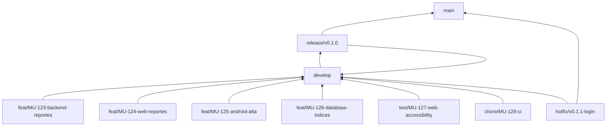

# Flujo Git y estrategia de ramas

## Decisión

El equipo usará un GitFlow liviano: dos ramas protegidas de larga vida y ramas cortas por tarea. No se crearán ramas permanentes por persona como `juan`, `santi` o `mauro`; ese modelo acumula cambios incompatibles y vuelve dolorosa la integración.



## Ramas permanentes

### `main`

- Representa la última versión estable y potencialmente desplegable.
- No recibe pushes directos.
- Solo recibe pull requests desde `release/*` o `hotfix/*`.
- Cada versión publicada se etiqueta: `v0.1.0`, `v0.2.0`, `v1.0.0`.
- Requiere CI verde y aprobación de Joaquín más una revisión del área afectada.

### `develop`

- Es el punto de integración de todo el trabajo del sprint.
- Todas las ramas de tarea nacen desde `develop` y vuelven a `develop` mediante pull request.
- Debe estar siempre compilable; puede contener funciones aún no liberadas, pero no cambios rotos.
- No recibe pushes directos y exige al menos una aprobación y CI verde.

## Ramas temporales

| Prefijo | Uso | Nace de | Se une en |
|---|---|---|---|
| `feat/` | Nueva funcionalidad | `develop` | `develop` |
| `fix/` | Corrección encontrada durante el sprint | `develop` | `develop` |
| `docs/` | Documentación | `develop` | `develop` |
| `test/` | Pruebas o QA automatizado | `develop` | `develop` |
| `refactor/` | Cambio interno sin alterar comportamiento | `develop` | `develop` |
| `chore/` | CI, Docker, herramientas o mantenimiento | `develop` | `develop` |
| `release/` | Estabilización de una versión | `develop` | `main` y luego `develop` |
| `hotfix/` | Corrección urgente de producción | `main` | `main` y luego `develop` |

Formato recomendado:

```text
<tipo>/MU-<número>-<área>-<descripción-corta>
```

Ejemplos:

```text
feat/MU-101-android-nuevo-reporte
feat/MU-102-backend-alta-reportes
feat/MU-103-database-asignaciones
feat/MU-104-web-cola-prioridades
test/MU-105-web-navegacion-teclado
chore/MU-106-devops-ci-inicial
docs/MU-107-contrato-asignaciones
```

## Distribución sugerida por integrante

| Integrante | Áreas frecuentes | Ejemplos de ramas |
|---|---|---|
| Joaquín | Android, arquitectura, documentación | `feat/MU-201-android-mapa`, `docs/MU-202-arquitectura-mapas` |
| Juan | Backend Ktor, auth, API, WebSocket | `feat/MU-203-backend-auth`, `fix/MU-204-backend-rate-limit` |
| Aldana | PostgreSQL, PostGIS, migraciones | `feat/MU-205-database-schema-reportes`, `fix/MU-206-database-index-bbox` |
| Santi | Angular, servicios, Leaflet | `feat/MU-207-web-tabla-reportes`, `feat/MU-208-web-mapa` |
| Quimey | Componentes web, accesibilidad, QA | `feat/MU-209-web-ui-dialog`, `test/MU-210-web-accessibility` |
| Mauro | Android de apoyo, Docker, CI, staging | `feat/MU-211-android-seguimiento`, `chore/MU-212-devops-compose` |

La tabla orienta la asignación, pero una persona puede trabajar en otra área con acompañamiento. La rama identifica la tarea y el área, no al propietario.

## Dónde se une el trabajo

1. Cada tarea se integra primero en `develop` mediante pull request.
2. Android, backend, base de datos y web no se fusionan entre sí; todos convergen en `develop`.
3. Cuando `develop` contiene el alcance de una versión, se crea `release/vX.Y.Z`.
4. En `release/*` solo se permiten correcciones, documentación y ajustes de versión.
5. La release validada se une a `main`, se etiqueta y también se devuelve a `develop` para conservar las correcciones.
6. Un hotfix nace de `main` y se integra tanto en `main` como en `develop`.

## Funciones que cruzan varias áreas

Una funcionalidad como delegación requiere datos, backend y web. No debe desarrollarse durante semanas en una sola rama gigante. Se divide por contrato:

1. `docs/MU-300-contrato-asignaciones`: acuerdo de tablas, DTOs, endpoints y errores.
2. `feat/MU-301-database-asignaciones`: migraciones e índices.
3. `feat/MU-302-backend-asignaciones`: casos de uso y API sobre el contrato aprobado.
4. `feat/MU-303-web-asignaciones`: interfaz Angular consumiendo ese contrato.
5. `test/MU-304-integracion-asignaciones`: prueba end-to-end y concurrencia.

Cada rama se une a `develop` cuando puede verificarse. El contrato permite que frontend avance con mocks tipados sin inventar respuestas incompatibles.

## Ciclo de una tarea

```bash
git switch develop
git pull --ff-only origin develop
git switch -c feat/MU-123-area-descripcion

# trabajo y commits pequeños
git add <archivos>
git commit -m "feat(area): descripción breve"

# sincronización antes del pull request
git fetch origin
git merge origin/develop
git push -u origin feat/MU-123-area-descripcion
```

Después se abre un pull request hacia `develop`. Para ramas de tarea se recomienda **Squash and merge**, de modo que cada historia deje un commit claro en la rama de integración.

## Revisión requerida

| Cambio | Revisores mínimos |
|---|---|
| Android | Joaquín o Mauro; Joaquín para arquitectura |
| Backend | Juan; Joaquín si cambia contrato, auth o seguridad |
| Base de datos | Aldana + Juan |
| Angular | Santi; Quimey para accesibilidad/consistencia visual |
| DevOps | Mauro + Juan o Aldana según el servicio |
| Documentación de alcance | Joaquín + dueño del área afectada |
| Release a `main` | Joaquín + un responsable técnico |

## Protección recomendada en GitHub

Para `main`:

- Prohibir push directo y force push.
- Exigir pull request, conversaciones resueltas y checks exitosos.
- Exigir dos aprobaciones para release; una debe ser de Joaquín.
- Exigir que la rama esté actualizada antes de unir.
- Restringir borrado de la rama.

Para `develop`:

- Prohibir push directo y force push.
- Exigir un pull request, una aprobación y CI verde.
- Descartar aprobaciones cuando aparecen cambios nuevos importantes.
- Eliminar automáticamente la rama temporal después del merge.

## Reglas de convivencia

- Una persona mantiene como máximo una tarea principal en curso.
- Las ramas deben durar días, no sprints completos.
- Nadie aprueba su propio pull request.
- No se suben secretos, `.env`, credenciales, keystores, builds, caches, `node_modules` ni PDF de trabajo.
- Los conflictos se resuelven con quien conoce el código afectado; no se descartan cambios ajenos.
- Si cambia un contrato, el pull request actualiza documentación y consumidores o declara explícitamente la secuencia de migración.
- Los bloqueos se comunican el mismo día.

## CODEOWNERS

El repositorio incluye `.github/CODEOWNERS.example`. Cuando todos compartan sus usuarios de GitHub, se reemplazan los marcadores por identificadores reales y se renombra a `.github/CODEOWNERS`. No debe activarse con usuarios inventados porque GitHub ignoraría las revisiones automáticas.
