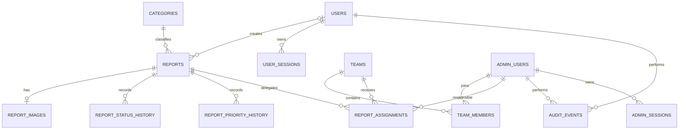

# Entidades de base de datos y DDL de ejemplo

## Objetivo

Este documento propone las entidades mínimas para el MVP de Mapa Urbano y muestra un DDL inicial de referencia. No reemplaza una migración revisada: Aldana y Juan deben convertirlo en migraciones versionadas y pruebas de integración.

## Entidades principales

| Entidad | Propósito | Relaciones principales |
|---|---|---|
| `categories` | Clasifica el problema urbano. | 1:N con `reports`. |
| `users` | Cuentas opcionales de vecinos. | 1:N con `reports` registrados y `user_sessions`. |
| `user_sessions` | Sesiones opacas y revocables de Android. | N:1 con `users`. |
| `reports` | Núcleo del reporte registrado o anónimo: texto, ubicación, estado, prioridad y seguimiento. | Pertenece a una categoría; opcionalmente a un usuario; tiene imagen, historiales y asignaciones. |
| `report_images` | Guarda la fotografía y sus metadatos dentro de PostgreSQL. | 1:1 con `reports` en el MVP. |
| `admin_users` | Usuarios municipales autenticados. | Integra equipos y ejecuta acciones auditadas. |
| `teams` | Áreas o cuadrillas municipales. | N:M con administradores; recibe asignaciones. |
| `team_members` | Relación entre equipos y administradores. | Une `teams` con `admin_users`. |
| `report_assignments` | Historial de delegación a equipo/responsable. | N:1 con reporte, equipo y usuarios. |
| `report_status_history` | Historial de estados del reporte. | N:1 con reporte y actor. |
| `report_priority_history` | Historial de prioridad y fecha objetivo. | N:1 con reporte y actor. |
| `audit_events` | Trazabilidad de acciones administrativas y de seguridad. | N:1 opcional con actor; referencia lógica a una entidad. |
| `admin_sessions` | Sesiones revocables del panel, si se persisten en PostgreSQL. | N:1 con `admin_users`. |
| `outbox_events` | Eventos pendientes de publicar por WebSocket. | Referencia lógica al agregado que produjo el evento. |

Entidades opcionales posteriores:

- `operational_areas`: polígonos PostGIS para delimitar zonas admitidas.
- `report_comments`: notas internas municipales con permisos y auditoría.
- `notification_events`: registro de push o email si se agregan esos canales.
- `report_duplicates`: relación entre reportes marcados como duplicados.

## Relación conceptual



## Por qué `report_images` es una tabla separada

La imagen no se coloca directamente en `reports` porque:

- Los listados y consultas de mapa leen muchos reportes y no deben arrastrar megabytes de contenido.
- La tabla principal conserva filas relativamente pequeñas y predecibles.
- El endpoint binario puede consultar la imagen solo después de autorizar la operación.
- Metadatos y restricciones de imagen evolucionan sin recargar el agregado principal.
- La relación puede pasar de 1:1 a 1:N sin rediseñar `reports`.

El binario se guarda como `BYTEA`, no como Base64. Base64 aumenta aproximadamente un tercio el tamaño y obliga a codificar/decodificar contenido innecesariamente.

## DDL inicial de referencia

```sql
CREATE EXTENSION IF NOT EXISTS pgcrypto;
CREATE EXTENSION IF NOT EXISTS postgis;

CREATE TYPE report_status AS ENUM (
    'pending',
    'in_progress',
    'resolved'
);

CREATE TYPE report_priority AS ENUM (
    'low',
    'medium',
    'high',
    'urgent'
);

CREATE TABLE categories (
    id UUID PRIMARY KEY DEFAULT gen_random_uuid(),
    slug VARCHAR(50) NOT NULL UNIQUE,
    name VARCHAR(80) NOT NULL,
    color_hex CHAR(7) NOT NULL,
    is_active BOOLEAN NOT NULL DEFAULT TRUE,
    sort_order INTEGER NOT NULL DEFAULT 0,
    created_at TIMESTAMPTZ NOT NULL DEFAULT now(),
    CONSTRAINT categories_color_hex_ck
        CHECK (color_hex ~ '^#[0-9A-Fa-f]{6}$')
);

CREATE TABLE admin_users (
    id UUID PRIMARY KEY DEFAULT gen_random_uuid(),
    username VARCHAR(80) NOT NULL,
    password_hash TEXT NOT NULL,
    is_active BOOLEAN NOT NULL DEFAULT TRUE,
    last_login_at TIMESTAMPTZ,
    created_at TIMESTAMPTZ NOT NULL DEFAULT now(),
    updated_at TIMESTAMPTZ NOT NULL DEFAULT now()
);

CREATE UNIQUE INDEX admin_users_username_lower_uq
    ON admin_users (lower(username));

CREATE TABLE users (
    id UUID PRIMARY KEY DEFAULT gen_random_uuid(),
    email VARCHAR(254) NOT NULL,
    display_name VARCHAR(100) NOT NULL,
    password_hash TEXT NOT NULL,
    is_active BOOLEAN NOT NULL DEFAULT TRUE,
    email_verified_at TIMESTAMPTZ,
    last_login_at TIMESTAMPTZ,
    created_at TIMESTAMPTZ NOT NULL DEFAULT now(),
    updated_at TIMESTAMPTZ NOT NULL DEFAULT now(),
    deleted_at TIMESTAMPTZ,
    CONSTRAINT users_email_not_blank_ck
        CHECK (length(btrim(email)) > 0),
    CONSTRAINT users_display_name_not_blank_ck
        CHECK (length(btrim(display_name)) > 0),
    CONSTRAINT users_deactivation_ck
        CHECK (deleted_at IS NULL OR is_active = FALSE)
);

CREATE UNIQUE INDEX users_email_lower_uq
    ON users (lower(email));

CREATE TABLE user_sessions (
    id UUID PRIMARY KEY DEFAULT gen_random_uuid(),
    user_id UUID NOT NULL REFERENCES users(id),
    token_hash BYTEA NOT NULL UNIQUE,
    expires_at TIMESTAMPTZ NOT NULL,
    last_used_at TIMESTAMPTZ NOT NULL DEFAULT now(),
    revoked_at TIMESTAMPTZ,
    created_at TIMESTAMPTZ NOT NULL DEFAULT now(),
    CONSTRAINT user_sessions_expiration_ck
        CHECK (expires_at > created_at),
    CONSTRAINT user_sessions_revocation_ck
        CHECK (revoked_at IS NULL OR revoked_at >= created_at)
);

CREATE INDEX user_sessions_user_expiration_idx
    ON user_sessions (user_id, expires_at DESC);

CREATE TABLE teams (
    id UUID PRIMARY KEY DEFAULT gen_random_uuid(),
    name VARCHAR(120) NOT NULL UNIQUE,
    description TEXT,
    is_active BOOLEAN NOT NULL DEFAULT TRUE,
    created_at TIMESTAMPTZ NOT NULL DEFAULT now(),
    updated_at TIMESTAMPTZ NOT NULL DEFAULT now()
);

CREATE TABLE team_members (
    team_id UUID NOT NULL REFERENCES teams(id),
    admin_user_id UUID NOT NULL REFERENCES admin_users(id),
    joined_at TIMESTAMPTZ NOT NULL DEFAULT now(),
    PRIMARY KEY (team_id, admin_user_id)
);

CREATE TABLE reports (
    id UUID PRIMARY KEY DEFAULT gen_random_uuid(),
    category_id UUID NOT NULL REFERENCES categories(id),
    user_id UUID REFERENCES users(id),
    status report_status NOT NULL DEFAULT 'pending',
    priority report_priority NOT NULL DEFAULT 'medium',
    title VARCHAR(150) NOT NULL,
    description TEXT NOT NULL,
    location geography(Point, 4326) NOT NULL,
    due_at TIMESTAMPTZ,
    tracking_code_hash BYTEA UNIQUE,
    tracking_code_hint VARCHAR(8),
    version BIGINT NOT NULL DEFAULT 0,
    created_at TIMESTAMPTZ NOT NULL DEFAULT now(),
    updated_at TIMESTAMPTZ NOT NULL DEFAULT now(),
    deleted_at TIMESTAMPTZ,
    CONSTRAINT reports_title_not_blank_ck
        CHECK (length(btrim(title)) > 0),
    CONSTRAINT reports_description_not_blank_ck
        CHECK (length(btrim(description)) > 0),
    CONSTRAINT reports_author_mode_ck
        CHECK (
            (
                user_id IS NOT NULL
                AND tracking_code_hash IS NULL
                AND tracking_code_hint IS NULL
            )
            OR
            (
                user_id IS NULL
                AND tracking_code_hash IS NOT NULL
                AND tracking_code_hint IS NOT NULL
            )
        ),
    CONSTRAINT reports_version_nonnegative_ck
        CHECK (version >= 0)
);

CREATE TABLE report_images (
    id UUID PRIMARY KEY DEFAULT gen_random_uuid(),
    report_id UUID NOT NULL UNIQUE
        REFERENCES reports(id) ON DELETE CASCADE,
    data BYTEA NOT NULL,
    content_type VARCHAR(100) NOT NULL,
    size_bytes BIGINT NOT NULL,
    width_px INTEGER NOT NULL,
    height_px INTEGER NOT NULL,
    original_filename VARCHAR(255),
    checksum_sha256 CHAR(64) NOT NULL,
    created_at TIMESTAMPTZ NOT NULL DEFAULT now(),
    CONSTRAINT report_images_content_type_ck
        CHECK (content_type IN ('image/jpeg', 'image/png', 'image/webp')),
    CONSTRAINT report_images_size_ck
        CHECK (
            size_bytes BETWEEN 1 AND 5242880
            AND size_bytes = octet_length(data)
        ),
    CONSTRAINT report_images_dimensions_ck
        CHECK (
            width_px BETWEEN 1 AND 12000
            AND height_px BETWEEN 1 AND 12000
        ),
    CONSTRAINT report_images_checksum_ck
        CHECK (checksum_sha256 ~ '^[0-9a-f]{64}$')
);

CREATE INDEX report_images_checksum_idx
    ON report_images (checksum_sha256);

CREATE TABLE report_status_history (
    id UUID PRIMARY KEY DEFAULT gen_random_uuid(),
    report_id UUID NOT NULL REFERENCES reports(id),
    changed_by UUID REFERENCES admin_users(id),
    from_status report_status,
    to_status report_status NOT NULL,
    note TEXT,
    changed_at TIMESTAMPTZ NOT NULL DEFAULT now()
);

CREATE TABLE report_priority_history (
    id UUID PRIMARY KEY DEFAULT gen_random_uuid(),
    report_id UUID NOT NULL REFERENCES reports(id),
    changed_by UUID NOT NULL REFERENCES admin_users(id),
    from_priority report_priority,
    to_priority report_priority NOT NULL,
    from_due_at TIMESTAMPTZ,
    to_due_at TIMESTAMPTZ,
    changed_at TIMESTAMPTZ NOT NULL DEFAULT now()
);

CREATE TABLE report_assignments (
    id UUID PRIMARY KEY DEFAULT gen_random_uuid(),
    report_id UUID NOT NULL REFERENCES reports(id),
    team_id UUID REFERENCES teams(id),
    responsible_admin_user_id UUID REFERENCES admin_users(id),
    assigned_by UUID NOT NULL REFERENCES admin_users(id),
    assigned_at TIMESTAMPTZ NOT NULL DEFAULT now(),
    unassigned_at TIMESTAMPTZ,
    CONSTRAINT report_assignments_target_ck
        CHECK (team_id IS NOT NULL OR responsible_admin_user_id IS NOT NULL),
    CONSTRAINT report_assignments_dates_ck
        CHECK (unassigned_at IS NULL OR unassigned_at >= assigned_at)
);

CREATE UNIQUE INDEX report_assignments_one_active_uq
    ON report_assignments (report_id)
    WHERE unassigned_at IS NULL;

CREATE TABLE audit_events (
    id UUID PRIMARY KEY DEFAULT gen_random_uuid(),
    actor_admin_user_id UUID REFERENCES admin_users(id),
    actor_user_id UUID REFERENCES users(id),
    action VARCHAR(120) NOT NULL,
    entity_type VARCHAR(80) NOT NULL,
    entity_id UUID,
    metadata JSONB NOT NULL DEFAULT '{}'::jsonb,
    source_ip INET,
    occurred_at TIMESTAMPTZ NOT NULL DEFAULT now(),
    CONSTRAINT audit_events_one_actor_type_ck
        CHECK (
            actor_admin_user_id IS NULL
            OR actor_user_id IS NULL
        )
);

CREATE INDEX reports_location_gist_idx
    ON reports USING GIST (location);

CREATE INDEX reports_status_created_idx
    ON reports (status, created_at DESC)
    WHERE deleted_at IS NULL;

CREATE INDEX reports_priority_due_idx
    ON reports (priority, due_at)
    WHERE deleted_at IS NULL;

CREATE INDEX reports_category_created_idx
    ON reports (category_id, created_at DESC)
    WHERE deleted_at IS NULL;

CREATE INDEX reports_user_created_idx
    ON reports (user_id, created_at DESC)
    WHERE user_id IS NOT NULL AND deleted_at IS NULL;

CREATE INDEX report_status_history_timeline_idx
    ON report_status_history (report_id, changed_at DESC);

CREATE INDEX report_priority_history_timeline_idx
    ON report_priority_history (report_id, changed_at DESC);

CREATE INDEX audit_events_entity_timeline_idx
    ON audit_events (entity_type, entity_id, occurred_at DESC);
```

## Reglas que no alcanza a expresar un `CHECK`

Estas reglas necesitan un caso de uso transaccional y, si se considera necesario, un trigger de respaldo:

- Si una asignación indica equipo y responsable, el responsable debe pertenecer a ese equipo.
- No se puede asignar a equipos o usuarios inactivos.
- Solo una transición de estado permitida puede crear historial.
- `version` aumenta en cada cambio administrativo y se compara para detectar conflictos.
- El código de seguimiento completo nunca se guarda ni se registra en logs.
- `reports.user_id` se obtiene de la sesión autenticada y nunca de un identificador enviado en el formulario.
- El modo `account` exige una sesión de vecino válida; el modo `anonymous` fuerza `user_id = NULL`, aunque exista sesión.
- Un reporte anónimo no se vincula posteriormente con una cuenta.
- Desactivar un usuario revoca sus sesiones sin eliminar sus reportes; la anonimización definitiva requiere una política aprobada.
- El contenido se valida decodificando una imagen real antes del `INSERT`; confiar solo en extensión o MIME no es suficiente.

## Consulta sin cargar imágenes

Los listados deben nombrar columnas explícitamente:

```sql
SELECT
    r.id,
    r.category_id,
    CASE WHEN r.user_id IS NULL THEN 'anonymous' ELSE 'account' END AS submission_mode,
    r.status,
    r.priority,
    r.title,
    r.location,
    r.due_at,
    r.version,
    r.created_at,
    EXISTS (
        SELECT 1
        FROM report_images ri
        WHERE ri.report_id = r.id
    ) AS has_image
FROM reports r
WHERE r.deleted_at IS NULL
ORDER BY r.created_at DESC
LIMIT 50;
```

El endpoint de imagen realiza otra consulta después de validar permisos:

```sql
SELECT
    ri.data,
    ri.content_type,
    ri.size_bytes,
    ri.checksum_sha256
FROM report_images ri
JOIN reports r ON r.id = ri.report_id
WHERE ri.report_id = :report_id
  AND r.deleted_at IS NULL;
```

## Consecuencias operativas

- El backup de PostgreSQL contiene datos e imágenes y debe cifrarse y probarse mediante restauración.
- El tamaño esperado debe calcularse como cantidad de imágenes por tamaño promedio más índices, historial y margen de crecimiento.
- El pool de conexiones no debe mantener transacciones abiertas mientras procesa o decodifica archivos.
- El backend valida primero en memoria o almacenamiento temporal limitado y abre la transacción solo al persistir.
- Si el volumen real hace inviable esta estrategia, el cambio requiere una ADR y una migración explícita; no se modifica de forma silenciosa.
