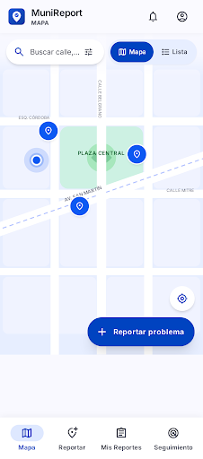
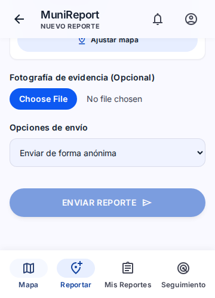
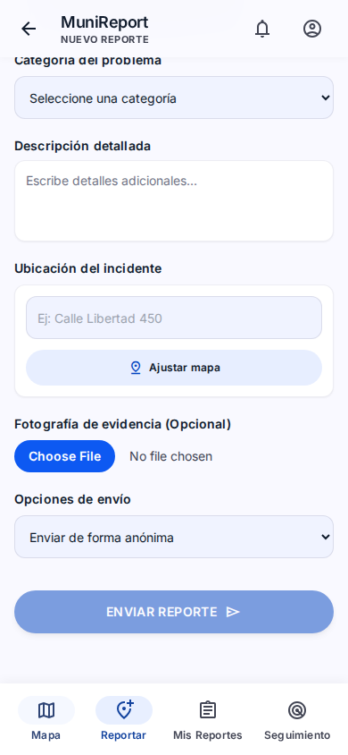
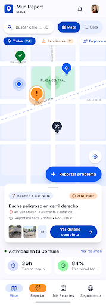
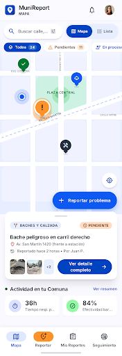

# Verificación de la interfaz en Google Stitch

## Resultado vigente — comprobado el 9 de septiembre de 2026

La revisión funcional más avanzada recuperada es **`66cfe9c846d34873b347ed0032dacacc`**, «MuniReport: Prototipo Interactivo (Revisión Quirúrgica Final)», del [proyecto Mapa-Urbano](https://stitch.withgoogle.com/projects/12550160159359787648). **Todavía no satisface la aceptación completa**, especialmente la fidelidad a las pantallas originales, las salidas de Confirmación, los retornos de acceso y la conservación explícita de la modalidad.

Tras la solicitud de volver a intentar la revisión, el MCP generó `2f6b151588e44d7fbdc5d32ba2efb39c` y luego `66cfe9c846d34873b347ed0032dacacc`. La primera incorporó las ocho pantallas principales más Lista, pero la segunda navegación rompía el encabezado, Lista apuntaba a un ID inexistente y los marcadores no se inicializaban. La segunda corrigió esos bloqueos y añadió código aleatorio, fotografía y listado propio. Una corrección posterior volvió a responder «The service is currently unavailable»; la lectura posterior no acreditó que esos pendientes se hubieran resuelto.

También se encontró `3ea7ef6c99bb428f84d9962397e48d7d`, «MuniReport Prototipo Unificado (Revisión Final)». Su HTML es idéntico byte a byte al de `2f6b151588e44d7fbdc5d32ba2efb39c` (SHA-256 `e55d0871e2d0f9e751416232557d922f5d4838414d33992dd3e4a17aa9be851d`). No constituye una corrección adicional ni debe elegirse por su título.

### Evidencia de la revisión quirúrgica

Las pruebas funcionales se ejecutaron sobre el HTML exportado sin modificar, con datos ficticios en memoria. Se recorrió la interfaz y se repitieron los casos de datos/fotografía en Chromium. Las dimensiones de las pruebas de scroll se comprobaron mediante `innerWidth`/`innerHeight`, sin inferirlas del tamaño solicitado al navegador integrado.

| Caso | Resultado comprobado en `66cfe9...` |
|---|---|
| Inicio y Lista | Tres marcadores al cargar y tres reportes en Lista. |
| Navegación consecutiva | Mapa → Lista → Reportar → Seguimiento → Mis reportes → Login ↔ Registro, sin el error del encabezado anterior. |
| Alta incompleta | Enviar permanece deshabilitado con formulario vacío. Login vacío muestra error. |
| Cancelar ubicación | Conserva el texto previo del borrador; esto no acredita coordenadas persistidas. |
| Dos altas anónimas | Códigos diferentes; consultar el primero después de crear el segundo devuelve el primer reporte. |
| Código inválido | Muestra error y sustituye el resultado anterior. La entrada vacía sigue pendiente. |
| Cuenta y listado propio | Tras entrar, los dos anónimos no aparecen; una nueva alta de cuenta aparece sola en Mis reportes y su confirmación oculta el código. |
| Identidad tras alta de cuenta | El código del primer anónimo sigue devolviendo ese reporte después de la nueva alta de cuenta. |
| Foto | Rechaza `text/plain` y una imagen declarada mayor a 5 MB; una PNG pequeña muestra previsualización. La comprobación de firma de archivo pertenece al servidor. |
| Errores JavaScript | Ningún error de ejecución en los recorridos anteriores. Esto no cubre acciones pendientes o avisos nativos. |

| Formulario, tras desplazar al final | Área de scroll | Borde inferior de Enviar | Inicio de barra inferior | Resultado |
|---|---|---:|---:|---|
| 360 × 500 CSS px | 955 px de contenido / 500 px visibles | 364 px | 420 px | Botón alcanzable, sin desbordamiento horizontal |
| 390 × 844 CSS px | 955 px de contenido / 844 px visibles | 708 px | 764 px | Botón alcanzable, sin desbordamiento horizontal |

Estas medidas validan el formulario en web. **No acreditan todas las pantallas, teclado Android real, texto al 200% ni todos los diálogos**; esos casos conservan su estado pendiente.

### Pendientes que impiden aceptar la revisión

1. **Distribución original:** Login, Registro, Perfil, Confirmación y formulario siguen simplificados. Se perdieron bloques de bienvenida, etiquetas e iconos, tarjetas de modalidad, grilla de categorías, estructura de comprobante, preferencias e historial. Mantener la paleta no equivale a conservar la composición. Las ocho pantallas de origen siguen siendo la referencia visual.
2. **Modalidad y acceso:** la opción de cuenta está deshabilitada para invitados; `updateHeaderAuth` restablece la modalidad al navegar. Avatar invitado conserva el origen en vez de Perfil, Registro termina en Mapa y no hay diálogo Conservar/Descartar borrador.
3. **Confirmación y retorno:** solo ofrece Mapa y copiar; faltan Seguimiento precargado o Mis reportes según modo y Compartir. El historial conserva el formulario consumido. No hay verificación integral de restauración de filtros, selección y scroll al volver.
4. **Código:** aunque aleatorio e independiente del ID, también se genera para altas de cuenta y la consulta no exige modalidad anónima. Faltan normalización de guiones/espacios y error al consultar vacío. Los 48 bits de la demostración no definen la entropía exigida al backend.
5. **Ubicación y filtros:** mover el pin solo modifica su posición visual; Confirmar escribe un texto fijo. La búsqueda local funciona, pero no hay filtros combinados por estado y categoría ni gestión completa de resultados vacíos.
6. **Avisos y errores:** copiar usa un `alert` después de escribir y no maneja rechazo; no hay Compartir ni Pegar completos. Ayuda tiene una vista sin acceso visible y las funciones de red/sesión muestran alertas, sin simular el fallo del envío. Desactivar no explica que conserva reportes y solo cierra la sesión de demostración.
7. **Renderizado y accesibilidad:** descripciones y otros textos se interpolan con `innerHTML`; deben insertarse como texto. Movimiento reducido cubre solo dos animaciones, no todas las transiciones. Falta verificar scroll universal, foco, Escape, teclado y texto ampliado.

### Limpieza del lienzo

El solicitante autorizó retirar pantallas y paneles que dejen de ser útiles **una vez terminadas las correcciones**. Esa condición todavía no se cumple; no se eliminaron pantallas en esta revisión. `3ea7ef6...` es duplicado exacto de `2f6b151...`; ambos son candidatos identificados para retirar tras aceptar su reemplazo. Las versiones anteriores y originales no se incorporan al flujo vigente por su presencia en el lienzo.

El MCP disponible permite generar/editar diseños, pero no eliminar pantallas individuales. La sesión web comprobada presenta el proyecto compartido con «Remix», sin controles de edición. Para completar la limpieza se necesita acceso de edición al lienzo, verificar qué revisiones fueron sustituidas y actualizar este inventario después de retirarlas. Las capturas históricas en Git preservan la trazabilidad.

## Historial de la primera revisión — 8 de septiembre de 2026

Fecha: **8 de septiembre de 2026**. Proyecto: [Mapa-Urbano en Google Stitch](https://stitch.withgoogle.com/projects/12550160159359787648), ID `12550160159359787648`.

Se inspeccionaron el lienzo, las capturas y el HTML exportado de las pantallas. Las versiones originales permanecen en el proyecto. Stitch creó seis revisiones por pantalla y un prototipo unificado; la verificación distingue lo que realmente ejecuta el HTML de lo que afirmó el generador.

El prototipo unificado `4898040798fc4cb48b45f6323ade4390` permite cambiar entre Mapa, Lista, Nuevo reporte, Mis reportes, Seguimiento, Login y Perfil. A 360 px se verificó que Mapa abre el formulario y que el formulario conserva la barra principal. La revisión mantiene la estética general de MuniReport y agrega un contenedor vertical desplazable.

El resultado **no cumple todavía todo el flujo objetivo**. Faltan vistas separadas de Registro y Confirmación; el alta navega directamente a Mis reportes, el modo cuenta/anónimo no está modelado, el retorno de acceso no conserva el destino solicitado y el seguimiento consulta el ID en lugar de un código opaco. También quedan IDs con forma `MNR-...`, nombres de autores dentro de fixtures, filtros incompletos y un manejador de retorno referenciado pero no definido.

Una tercera corrección dirigida exclusivamente a esos defectos fue enviada mediante el MCP de Stitch. El servicio respondió temporalmente no disponible después de procesarla y no produjo una nueva revisión comprobable. La instrucción de la herramienta prohíbe repetir una edición cuando ocurre este tipo de fallo, porque podría terminar de forma asíncrona y duplicar resultados. Por eso este informe mantiene esos puntos como pendientes y no declara el prototipo listo para implementación.

## Pantallas y revisiones

| Referencia original | Revisión creada | Resultado observado |
|---|---|---|
| Mapa interactivo `956adf...` | `f84e5df03d3a4159b65b9c4585d2dc5c` | Conserva composición y añade interacciones locales; varias conexiones quedaron como simulaciones, por lo que no es la fuente funcional. |
| Mis reportes interactivo `3711e9...` | `ac3d2b14da0847c29d9c74513b72fd8d` | Mantiene filtros locales; acciones de detalle/acceso aún usan sustitutos de navegación. |
| Nuevo reporte `ffb2e9...` | `e52e5b2a03044d4b9d15e1ac8105bd8d` | Añade selector de ubicación y validación local; el envío no navega realmente a confirmación. |
| Confirmación y seguimiento | `bf44556d9a3b4320aad162e6ff501355` | Conserva la vista de seguimiento; aún fabrica un código al fallar Pegado y activa una alerta fuera del MVP. |
| Login/Registro | `14d8aa06a29045faa384685be02dea3d` | Corrige parte del texto y funciones futuras; no contiene Registro navegable ni retorno interno completo. |
| Perfil `31d374...` | `2750e200fe8a422f808364a38efb577f` | Conserva estética; acciones sensibles siguen simuladas. |
| Prototipo anterior `7dceab...` | `4898040798fc4cb48b45f6323ade4390` | Integra siete vistas contando Lista; conexión parcial, con defectos históricos detallados abajo. |
| Reintento unificado | `2f6b151588e44d7fbdc5d32ba2efb39c` | Ocho pantallas más Lista, con bloqueos de router; [captura](assets/interfaces/stitch-2026-09-08/2f6b151588e44d7fbdc5d32ba2efb39c-revision-unificada.png). |
| Copia del reintento | `3ea7ef6c99bb428f84d9962397e48d7d` | Mismo HTML y captura que `2f6b151...`; no se duplica el archivo de imagen en Git. |
| Corrección quirúrgica | `66cfe9c846d34873b347ed0032dacacc` | Mejoras y pendientes comprobados en el resultado vigente de este informe. |

Las capturas completas anteriores y posteriores están en [`assets/interfaces/stitch-2026-09-08`](assets/interfaces/stitch-2026-09-08/). Las imágenes documentan composición visual; el HTML no se versiona porque es una exportación temporal de inspección y depende de recursos externos.

## Matriz histórica de `489804...`

| Caso | Resultado | Evidencia / consecuencia |
|---|---|---|
| Originales conservados | Cumple | Los IDs originales continúan visibles en el proyecto junto a las revisiones. |
| Mapa → Nuevo reporte | Cumple parcialmente | El FAB abre `view-create` dentro del prototipo unificado. |
| Mapa/Lista | Cumple parcialmente | Existen ambas vistas y se crean marcadores/tarjetas desde fixtures; búsqueda y filtros combinados no están completos. |
| Marcador/tarjeta → mismo detalle | Cumple parcialmente | Se conserva `selectedReport`, pero el detalle se deriva al seguimiento y no existe el modal completo especificado. |
| Mis reportes protegido | Cumple parcialmente | El guard abre Login sin sesión; no guarda correctamente `returnTo` ni separa reportes de cuenta/anónimos. |
| Login ↔ Registro | No cumple | No existe `view-register`; Login termina en Mapa. |
| Formulario completo y modalidad | No cumple | Existe `view-create`, pero falta el selector cuenta/anónimo y la foto no tiene manejo completo verificable. |
| Ajustar ubicación con confirmar/cancelar | Cumple parcialmente | Existe un modal y conserva campos visibles; usa texto de ubicación, no coordenadas temporales reales. |
| Alta → Confirmación → salida según modo | No cumple | No existe `view-confirmation`; el alta va directamente a Mis reportes. |
| Seguimiento por código opaco | No cumple | Busca `report.id`; fixtures e input usan `MNR-84920`. |
| Copiar/compartir con éxito real | No comprobable | No hay confirmación separada en el prototipo unificado. |
| Atrás interno y cierre de panel primero | No cumple | El HTML referencia `handleBack()` sin definirlo y no implementa pila de modales. |
| Funciones futuras sin éxito falso | Cumple parcialmente | Existe un diálogo común, pero no todos los controles visibles están cubiertos. |
| Privacidad del autor | No cumple | Fixtures conservan `user: 'Juan P.'`, `María G.` y `Carlos R.` aunque la vista pública objetivo no debe exponerlos. |
| Scroll a 360 px | Cumple parcialmente | Se verificó Mapa → formulario a 360 × 640 y los controles mantienen ancho; el contenedor usa `overflow-y:auto`. |
| Altura 500 px, teclado y texto 200% | Pendiente | La exportación usa `body overflow-hidden` y `main min-h-screen`; requiere prueba y corrección antes de aceptar el comportamiento. |
| Movimiento reducido | No cumple | La exportación unificada no contiene una regla `prefers-reduced-motion`. |
| Sin alertas ni enlaces vacíos | Cumple en prototipo unificado | La auditoría estática no encontró `alert`, `confirm`, `history.back`, `href="#"` ni `DATA:SCREEN` en esa revisión; las revisiones individuales anteriores sí contienen sustitutos. |

## Casos que debe cubrir la implementación

La [matriz completa de UX](05-ux-e-interfaces.md#matriz-de-acciones-e-integración) es el criterio de aceptación. Además, ejecutar estos recorridos sobre Compose y backend real:

1. Invitado: Mapa → detalle → volver; filtros, selección, centro del mapa y scroll se restauran.
2. Anónimo: Reportar → ajustar/cancelar ubicación → validar foto → enviar → Confirmación con código → Seguimiento del mismo reporte → Mapa.
3. Cuenta sin sesión: completar borrador `account` → Login o Registro → cancelar y volver; luego autenticar y retomar el mismo borrador.
4. Cuenta autenticada: enviar → Confirmación sin código → Mis reportes con el alta → detalle → volver a la misma posición.
5. Sesión vencida durante el alta: conservar borrador, reautenticar y no transformar el reporte en anónimo.
6. Errores: formulario incompleto, GPS/cámara denegados, foto inválida o mayor a 5 MB, red caída, respuesta incierta y código inválido.
7. Acciones del sistema: copia fallida, compartir cancelado y pegado denegado sin mostrar éxito ni fabricar datos.
8. Retorno: cerrar primero cada diálogo; conservar/descartar borrador; volver desde Confirmación sin repetir el envío.
9. Layout: 360 y 390 dp, 500 px de alto, teclado visible, texto al 200%, orientación horizontal y movimiento reducido.

## Condición para considerar el diseño conectado

Una revisión posterior de Stitch o la implementación Android solo puede marcarse completa cuando las ocho vistas y todos los retornos de la matriz funcionen sin enlaces simulados, el código sea independiente del ID y exclusivo de anónimos, no haya autor público, el scroll alcance cada acción y las funciones futuras no cambien estado. La autenticación y el backend de demostración del prototipo deben seguir identificados como simulaciones. La revisión debe volver a inspeccionarse y probarse; el título “Conectado” no constituye evidencia.
